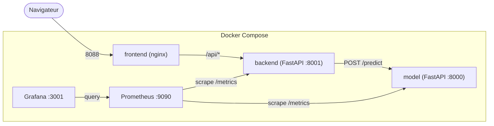

# README Romain

## 🧭 Architecture



## 🚀 3 commandes pour démarrer

```bash
# 1. Cloner et se placer dans le repo
git clone https://github.com/joellegermanos-prog/M5-B1-Romain_Joelle.git
cd M5-B1-Romain_Joelle

# 2. Lancer les 3 services + monitoring (build inclus)
docker compose up --build

# 3. Vérifier que tout est sain
docker compose ps
```

Accès une fois lancé : frontend [http://localhost:8088](http://localhost:8088),
backend [http://localhost:8001](http://localhost:8001), model [http://localhost:8000](http://localhost:8000).

## 📦 Image sur GHCR

Image `model` publiée sur GitHub Container Registry :
[github.com/joellegermanos-prog/M5-B1-Romain_Joelle/pkgs/container/m5-b1-romain_joelle%2Fmodel](https://github.com/joellegermanos-prog/M5-B1-Romain_Joelle/pkgs/container/m5-b1-romain_joelle%2Fmodel)

Le workflow utilise le secret GitHub `GHCR_TOKEN` s'il est defini, puis
revient a `GITHUB_TOKEN`. Pour publier depuis un depot dont le package GHCR
n'est pas lie au depot, ajouter `GHCR_TOKEN` comme secret Actions avec un token
ayant la permission `write:packages`.

## 📊 Grafana local

Dashboard accessible sur [http://localhost:3001](http://localhost:3001).

Vue du dashboard "Pyrenex Prod" :


