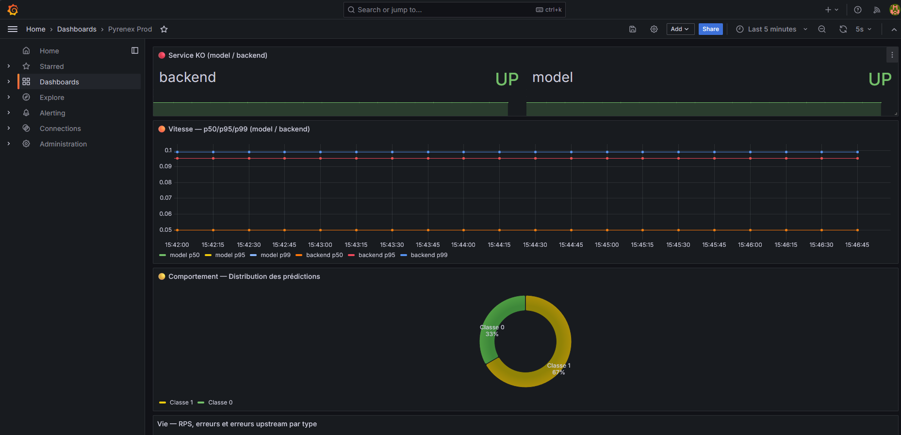

# README Romain

## 🧭 Architecture


## 🚀 3 commandes pour démarrer

```bash
# 1. Cloner et se placer dans le repo
git clone https://github.com/joellegermanos-prog/M5-B1-Romain_Joelle.git
cd M5-B1-Romain_Joelle

# 2. Lancer les 3 services + monitoring (build inclus)
docker compose up --build

# 3. Vérifier que tout est sain
docker compose ps
```

Accès une fois lancé : frontend [http://localhost:8088](http://localhost:8088),
backend [http://localhost:8001](http://localhost:8001), model [http://localhost:8000](http://localhost:8000).

## 📦 Image sur GHCR

Image `model` publiée sur GitHub Container Registry :
[github.com/joellegermanos-prog/M5-B1-Romain_Joelle/pkgs/container/m5-b1-romain_joelle%2Fmodel](https://github.com/joellegermanos-prog/M5-B1-Romain_Joelle/pkgs/container/m5-b1-romain_joelle%2Fmodel)

Le workflow utilise le `GITHUB_TOKEN` natif avec la permission
`packages: write`. Pour un package GHCR deja existant, autoriser une fois le
depot `joellegermanos-prog/certification` dans **Package settings > Manage
Actions access**. Aucun PAT `GHCR_TOKEN` n'est necessaire.

Le job `deploy-on-prem` déploie automatiquement les images immuables du commit
sur l'infrastructure cible après un push accepté sur `main`. Il est activé
lorsque les secrets GitHub `DEPLOY_HOST`, `DEPLOY_USER`, `DEPLOY_SSH_KEY` et
`DEPLOY_PATH` sont configurés; `DEPLOY_PORT` est facultatif. Le répertoire
distant doit contenir le `docker-compose.yml` et être accessible par l'utilisateur
de déploiement. Le registre usagers est configuré séparément par
`USER_REGISTRY_URL` dans l'environnement Compose cible.

### Intégration SI et historique

Le backend accepte `usager_id` et `session_id`. Si `USER_REGISTRY_URL` est
configuré, chaque usager est vérifié par `GET /users/{usager_id}` avant
l'inférence; une indisponibilité du référentiel retourne `503`. Sans URL
configurée, le mode local conserve le fonctionnement de démonstration mais ne
prétend pas valider le référentiel national.

Les prédictions sont conservées dans SQLite et consultables par
`GET /history?session_id=...` ou `GET /history?usager_id=...`. Le frontend crée
une session conseiller persistante dans le navigateur et affiche son
historique.

La route `/train` est désactivée par défaut avec `ALLOW_DIRECT_TRAIN=false`.
Le chemin de production reste `scripts/retrain.py`, suivi de l'évaluation et
de la promotion du candidat. L'activation de `/train` est réservée aux tests
contrôlés avec `ALLOW_DIRECT_TRAIN=true` et `TRAIN_API_TOKEN`.

## 📊 Grafana local

Dashboard accessible sur [http://localhost:3001](http://localhost:3001).

### MLflow partagé

Compose démarre un serveur MLflow sur
[http://localhost:5000](http://localhost:5000). Le backend de tracking SQLite
et les artefacts sont conservés dans les volumes Docker `mlflow_backend` et
`mlflow_artifacts`. Le model et le retrainer utilisent par défaut
`http://mlflow:5000`; un autre serveur peut être choisi avec
`MLFLOW_TRACKING_URI`.

Pour lancer une évaluation depuis l'hôte :

```powershell
$env:MLFLOW_TRACKING_URI = "http://localhost:5000"
python scripts/evaluate_model.py --release-tag demo
$env:MLFLOW_TRACKING_URI = $null
```

Les runs contiennent la version, le tag de release, les hyperparamètres lus
depuis `configuration.model_parameters`, les métriques, les tags de statut et
le fichier de métadonnées du modèle.

Vue du dashboard "Pyrenex Prod" :



### Rapport de drift batch

Les PSI, tests KS et Chi² sont calculés par batch puis publiés pour Grafana
via le fichier `reports/drift.prom`, servi par le backend sur
`/drift-metrics`. Pour actualiser les panels de drift :

```powershell
python scripts/drift_analysis.py `
    --reference data/drift_reference.csv `
    --current data/drift_current.csv `
    --output reports/drift.json `
    --prometheus-output reports/drift.prom
```

Le seuil PSI utilisé par le dashboard est : stable sous `0,10`, à surveiller
entre `0,10` et `0,25`, alerte à partir de `0,25`. Ce rapport est une mesure
batch et doit être régénéré lorsque la fenêtre courante est mise à jour.
